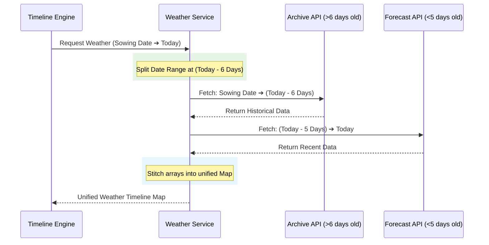

# Integrating Open-Meteo API for Agronomic Digital Twins

When building a physics-based digital twin for agriculture, **daily historical weather data** is the fuel that powers the engine. 

Our FAO-56 and GDD models require daily inputs of:
- **Max / Min Temperature:** To calculate Growing Degree Days (GDD) for phenological phases.
- **Evapotranspiration (ET0):** To calculate the daily water loss from the crop.
- **Precipitation:** To add water back into the soil moisture bucket.
- **Humidity:** To calculate disease risk factors.

To get this data, we integrated the [Open-Meteo API](https://open-meteo.com/), an open-source weather API that requires no API keys. However, integrating it robustly presented a unique challenge regarding data lag and historical limits.

---

## 🛑 The Problem: The Archive vs. Forecast Dilemma

Open-Meteo provides two distinct APIs for historical data, both with significant limitations:

1. **The Historical Archive API** (`archive-api.open-meteo.com`)
   - **Pros:** Contains decades of historical weather data (back to 1940).
   - **Cons:** It takes ~5 days to process satellite and station data into the archive. If you request data for "yesterday" or "today", the API returns a **400 Bad Request error**.

2. **The Forecast API** (`api.open-meteo.com/v1/forecast`)
   - **Pros:** Contains real-time current data, forecast data, and short-term historical data up to today.
   - **Cons:** The historical lookback is strictly limited to **90 days**. If a farmer planted a crop 120 days ago, this API will crash when requesting the full timeline.

If we just used the Archive API, our digital twin would always be stuck 5 days in the past. If we just used the Forecast API, we couldn't simulate older crops.

---

## 🛠️ The Concept: Dynamic API Stitching

To create a bulletproof weather engine, we designed a **Stitching Engine**. 

When the timeline engine requests weather data from a `startDate` to an `endDate`, our service calculates the dates and splits the request:
- Dates older than **6 days ago** are routed to the **Archive API**.
- Dates within the **last 5 days** (up to today) are routed to the **Forecast API**.
- The results are seamlessly merged into a single `Map<string, WeatherDay>` so the rest of the application has no idea two different APIs were used.

### Visualization of the Stitching Logic



---

## 💻 The Code Implementation

Here is the exact implementation used in our `weather.service.ts` to achieve this seamless stitching.

```typescript
// src/utils/weather.service.ts

export const getHistoricalWeather = async (
  lat: number,
  lon: number,
  startDate: string,
  endDate: string
): Promise<Map<string, WeatherDay>> => {
  try {
    const weatherMap = new Map<string, WeatherDay>();

    const start = new Date(startDate);
    const end = new Date(endDate);
    
    const today = new Date();
    const archiveCutoff = new Date(today);
    archiveCutoff.setDate(today.getDate() - 6);

    // ==========================================
    // 1. Fetch from Archive API (Older Data)
    // ==========================================
    if (start <= archiveCutoff) {
      const archiveEnd = end < archiveCutoff ? new Date(end) : new Date(archiveCutoff);
      
      const archiveStartStr = start.toISOString().split('T')[0];
      const archiveEndStr = archiveEnd.toISOString().split('T')[0];
      
      const archiveUrl = `https://archive-api.open-meteo.com/v1/archive?latitude=${lat}&longitude=${lon}&start_date=${archiveStartStr}&end_date=${archiveEndStr}&daily=precipitation_sum,temperature_2m_max,temperature_2m_min,relative_humidity_2m_mean,et0_fao_evapotranspiration&timezone=auto`;
      
      const res = await fetch(archiveUrl);
      if (res.ok) {
        const data = await res.json();
        // Loop and add to weatherMap...
      }
    }

    // ==========================================
    // 2. Fetch from Forecast API (Recent Data)
    // ==========================================
    if (end > archiveCutoff) {
      const forecastStart = start > archiveCutoff ? new Date(start) : new Date(archiveCutoff);
      
      // Ensure we don't overlap with archive data
      if (start <= archiveCutoff) {
        forecastStart.setDate(forecastStart.getDate() + 1); 
      }
      
      if (forecastStart <= end) {
        const forecastStartStr = forecastStart.toISOString().split('T')[0];
        const forecastEndStr = end.toISOString().split('T')[0];

        const forecastUrl = `https://api.open-meteo.com/v1/forecast?latitude=${lat}&longitude=${lon}&start_date=${forecastStartStr}&end_date=${forecastEndStr}&daily=precipitation_sum,temperature_2m_max,temperature_2m_min,relative_humidity_2m_mean,et0_fao_evapotranspiration&timezone=auto`;
        
        const res = await fetch(forecastUrl);
        if (res.ok) {
          const data = await res.json();
          // Loop and add to weatherMap...
        }
      }
    }

    return weatherMap;
  } catch (err) {
    console.error("Weather API Error:", err);
    throw err;
  }
};
```

### Important Edge Cases Handled:
1. **Timezone Discrepancies:** If the user's local timezone is ahead of the server's UTC timezone, a crop planted "today" might result in a `startDate` that is technically greater than the server's `endDate`. This was fixed in the engine by forcing `endDate` to be at least `startDate`.
2. **Missing Parameters:** We gracefully handle situations where `humidity` or `et0` might be missing on specific dates by providing defaults (e.g. `|| 0`).
